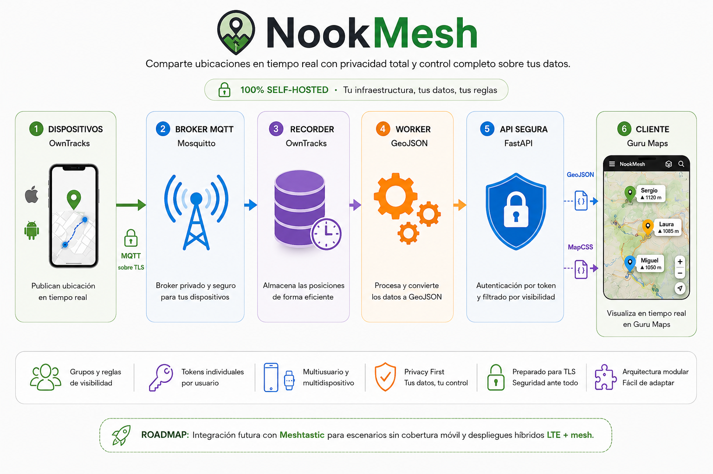

# NookMesh

🇬🇧 [English version](README.md)


[](https://ko-fi.com/nooktrail)

**Plataforma autoalojada para compartir ubicación en tiempo real con privacidad total y control completo sobre tus datos.**

NookMesh es una plataforma open source de compartición de ubicación en tiempo real basada en **OwnTracks**, **MQTT**, **Docker** y una **API GeoJSON protegida**, diseñada para quienes quieren mantener el control completo sobre su infraestructura, autenticación y datos de localización.

Nació inicialmente para viajes en moto entre amigos, pero su arquitectura modular permite adaptarlo a familias, grupos outdoor, equipos técnicos, comunidades y futuras arquitecturas híbridas con múltiples fuentes de ubicación.

> ⚠️ Proyecto en evolución activa. La arquitectura principal es funcional y utilizable, aunque algunas capacidades continúan refinándose.

## NookMesh en acción


## Qué ofrece

- Seguimiento de ubicación en tiempo real mediante **OwnTracks + MQTT**
- Infraestructura **100% autoalojada**
- API GeoJSON protegida con autenticación individual
- Visualización directa en **Guru Maps**
- Soporte multiusuario y multi-dispositivo
- Control avanzado de visibilidad entre usuarios
- Gestión automática de expiraciones y suscripciones
- Arquitectura modular basada en Docker
- Despliegue seguro mediante TLS (recomendado)
- Base preparada para futuras integraciones híbridas

## Stack actual

NookMesh utiliza actualmente:

- OwnTracks
- Mosquitto
- OwnTracks Recorder
- FastAPI
- Docker
- GeoJSON
- Guru Maps
- Subscription Service

## Cómo funciona

NookMesh recibe ubicaciones desde dispositivos móviles mediante **OwnTracks**, las procesa dentro de tu propia infraestructura y expone únicamente los datos autorizados a clientes compatibles.

Toda la autenticación, gestión de usuarios, expiraciones, filtrado de visibilidad y control de acceso ocurre dentro de tu propio backend.



📘 Arquitectura detallada en la documentación técnica.

---

## Casos de uso

### 🏍 Viajes en moto y rutas en grupo

Visualiza la posición de compañeros durante rutas o viajes largos directamente en Guru Maps.

### 👨‍👩‍👧‍👦 Familia y amigos

Comparte ubicación entre personas de confianza con reglas de visibilidad personalizadas.

### 🥾 Actividades outdoor

Senderismo, ciclismo, 4x4 o cualquier actividad donde coordinar posiciones sea útil.

### 💼 Comunidades, clubes y asociaciones

Permite gestionar acceso temporal de miembros mediante expiraciones automáticas y renovaciones sin depender de servicios externos.

### 🛠 Usuarios técnicos y self-hosters

Ideal para quienes prefieren controlar completamente infraestructura, almacenamiento y autenticación.

### 📡 Transporte híbrido (roadmap)

Futuras integraciones con redes mesh, gateways y fuentes alternativas de ubicación para escenarios sin cobertura móvil convencional.

---

## Instalación rápida

### Requisitos

Necesitarás:

- Linux o NAS compatible con Docker
- Docker Engine
- Docker Compose v2
- `jq`
- `openssl`
- Dominio o subdominios (recomendado)
- Certificados TLS válidos (recomendado para producción)
- App **OwnTracks**
- Cliente GeoJSON compatible (**Guru Maps recomendado**)

Entornos habituales compatibles:

- Synology NAS
- Ubuntu Server
- Debian
- mini PCs Linux
- VPS Linux
- otros hosts compatibles con Docker

---

### Inicio rápido

Clona el repositorio:

```bash
git clone https://github.com/sercontri/nookmesh.git
cd nookmesh
```

Copia la configuración de ejemplo:

```bash
cp config/users.example.json config/users.json
cp config/filtros.example.env config/filtros.env
cp config/recorder.example.env config/recorder.env
```

Edita la configuración según tu entorno.

Genera credenciales y archivos operativos:

```bash
./auth/generate.sh
```

El generador crea automáticamente:

- credenciales MQTT
- ACL MQTT
- tokens API
- runtime de visibilidad
- estados operativos de usuario

Inicia los servicios:

```bash
docker compose -f mqtt/docker-compose.yml up -d
docker compose -f recorder/docker-compose.yml up -d
docker compose -f worker/docker-compose.yml up -d
docker compose -f api/docker-compose.yml up -d
docker compose -f subscriptions/docker-compose.yml up -d
```

Configura:

- OwnTracks
- Guru Maps (u otro cliente GeoJSON compatible)
- TLS (recomendado)

NookMesh incluye además un overlay de ejemplo para importación rápida en Guru Maps:

```text
docs/assets/gurumaps/nookmesh_gurumaps_overlay.ms
```

📘 Guía completa en la documentación técnica.

---

## Privacidad y seguridad

NookMesh está diseñado con una filosofía centrada en privacidad y soberanía de datos.

Con NookMesh:

- Tus ubicaciones permanecen en tu infraestructura
- Cada usuario tiene credenciales MQTT independientes
- Cada usuario recibe su propio token API
- La visibilidad entre usuarios se controla mediante reglas internas
- Las suscripciones y expiraciones se gestionan localmente dentro de tu propia infraestructura
- Los servicios pueden protegerse con **MQTT over TLS** y **HTTPS**
- No existe dependencia obligatoria de plataformas cloud externas

Especialmente pensado para quienes valoran:

- privacidad
- control
- transparencia
- auditabilidad
- autoalojamiento

## Documentación

La documentación técnica incluye:

- instalación detallada
- usuarios, estados y suscripciones
- modelo de visibilidad
- integración con OwnTracks
- integración con Guru Maps
- personalización visual con MapCSS
- MQTT y TLS
- seguridad y autenticación
- endpoints GeoJSON
- arquitectura interna
- resolución de problemas
- roadmap técnico

📘 **[Documentación técnica completa](docs/INDEX.es.md)**

## Hoja de ruta

NookMesh es un proyecto activo en evolución.

Líneas previstas de desarrollo:

- integración híbrida con redes mesh
- despliegues LTE + mesh
- compatibilidad con más clientes GeoJSON
- panel de administración web
- mejor observabilidad
- configuración más modular
- mejor experiencia de despliegue
- portal web de documentación (Docusaurus)

## Contribuir

Las contribuciones son bienvenidas.

Puedes ayudar:

- reportando bugs
- proponiendo mejoras
- mejorando documentación
- sugiriendo integraciones
- enviando pull requests
- compartiendo casos de uso reales

Si contribuyes con código:

- no incluyas secretos ni credenciales reales
- usa archivos de ejemplo
- mantén coherencia con la arquitectura actual
- documenta cambios relevantes

## Apoya el proyecto

NookMesh es un proyecto independiente desarrollado en tiempo personal.

Si te resulta útil, puedes apoyar:

- ⭐ dar una estrella al repositorio
- 🐞 reportar errores o mejoras
- 📖 mejorar documentación
- 🔀 contribuir con código
- 📣 compartir el proyecto
- ☕ apoyar el desarrollo en [Ko-fi](https://ko-fi.com/nooktrail)

Tu apoyo ayuda a mantener infraestructura de pruebas, mejorar documentación y continuar desarrollando herramientas abiertas centradas en privacidad.

## Licencia

NookMesh se distribuye bajo licencia **GNU Affero General Public License v3.0 (AGPLv3)**.

En resumen:

- puedes usarlo libremente
- puedes modificarlo
- puedes desplegarlo en tu infraestructura
- puedes redistribuirlo
- puedes ofrecer servicios basados en NookMesh respetando las obligaciones de la licencia AGPLv3

Si modificas el proyecto y lo ofreces como servicio accesible por red, esas modificaciones deberán mantenerse bajo la misma licencia.

Consulta [LICENSE](LICENSE) para el texto legal completo.