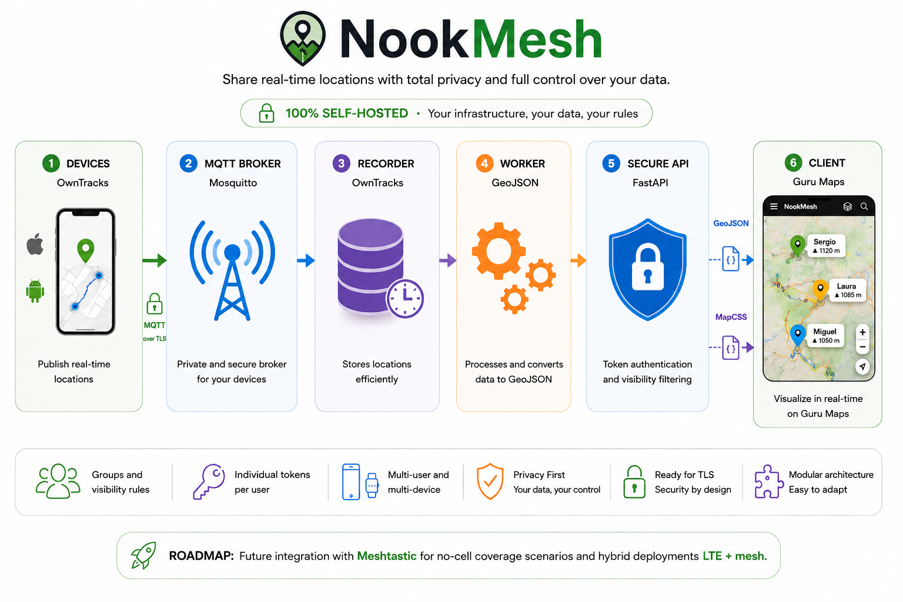

# Architecture Overview

NookMesh is a self-hosted real-time location sharing platform built around decoupled components that work together.

The architecture is designed with a focus on:

- privacy
- modularity
- self-hosting
- security
- interoperability
- extensibility

---

## General flow

The current operational flow is:

```text
OwnTracks
   ↓
MQTT Broker (Mosquitto)
   ↓
OwnTracks Recorder
   ↓
GeoJSON Worker
   ↓
Protected API
   ↓
Visualization clients
```

In practice:

1. OwnTracks publishes locations via MQTT
2. Mosquitto authenticates and distributes messages
3. OwnTracks Recorder persists locations
4. The worker generates enriched GeoJSON
5. The API authenticates the consumer via token
6. The API applies visibility rules and operational filters
7. The client receives only authorized data

---

## Diagram



---

## Main components

### OwnTracks

Primary location capture client.

Responsibilities:

- GPS capture
- movement detection
- MQTT publishing
- device metadata transmission

Currently supported platforms:

- iPhone / iPad
- Android

OwnTracks is currently the only officially supported location source.

---

### MQTT Broker

Internal messaging backbone.

Current implementation:

```text
Mosquitto
```

Responsibilities:

- MQTT authentication
- credential validation
- ACL enforcement
- MQTT message distribution
- producer / consumer decoupling

Topics used:

```text
owntracks/<user>/<device>
```

Example:

```text
owntracks/sergio/iphone
```

---

### OwnTracks Recorder

Primary persistence service.

Responsibilities:

- subscription to the MQTT broker
- reception of OwnTracks events
- persistent storage
- latest state maintenance
- preservation of the native recorder data model

Typical location:

```text
data/owntracks/store/
```

Especially:

```text
data/owntracks/store/last/
```

This component does not apply:

- API authentication
- visibility rules
- visual rendering

---

### GeoJSON Worker

Transformation service.

Responsibilities:

- reading persisted locations
- loading visibility runtime
- age calculation
- metadata enrichment
- public GeoJSON generation
- preparation of visual properties

Current output:

```text
data/public/nookmesh.geojson
```

The worker:

- filters stale locations
- adds contextual information
- builds auxiliary rendering properties

It does not apply viewer/token-specific filtering.

That work happens in the API.

---

### Protected API

Authenticated access and dynamic filtering layer.

Responsibilities:

- API token authentication
- viewer identification
- visibility rule enforcement
- contextual filtering
- optional self exclusion
- proximity filtering
- multi-device merging
- final generation of client-consumable GeoJSON

The API does not simply return raw GeoJSON.

It delivers a:

```text
viewer-aware
```

version filtered according to the authenticated user's permissions.

---

### Authentication and runtime generator

Core operational component:

```text
auth/generate.sh
```

Responsibilities:

- MQTT password database generation
- MQTT ACL generation
- API token generation and maintenance
- selective regeneration
- cleanup of deleted users
- visibility runtime construction
- automatic deployment of generated files
- restart of compatible services

Single source of truth:

```text
config/users.json
```

Generated artifacts:

```text
config/generated/mqtt-passwords.txt
config/generated/mqtt-acl.txt
config/generated/api-tokens.txt
data/runtime/visibility.json
```

---

### Visualization clients

Final consumers.

Current primary integration:

```text
Guru Maps
```

Consumed via:

```text
GeoJSON + MapCSS
```

The architecture potentially allows other GeoJSON-compatible clients.

Examples:

- GIS clients
- web dashboards
- future integrations

---

## Separation of responsibilities

The architecture clearly separates functional layers.

### Capture

OwnTracks

---

### Transport

Mosquitto / MQTT

---

### Persistence

OwnTracks Recorder

---

### Transformation

GeoJSON Worker

---

### Authentication and authorization

Protected API

---

### Operational provisioning

auth/generate.sh

---

### Visualization

Guru Maps / compatible clients

---

## Architectural philosophy

NookMesh avoids monolithic design.

Each service maintains a clearly defined responsibility.

Advantages:

- simpler maintenance
- clearer debugging
- modular deployments
- better isolation
- independent evolution
- future component replacement

---

## Design principles

### Privacy-first

Data remains under the deployment owner's control.

---

### Self-hosted

The entire infrastructure can run locally or on privately owned infrastructure.

---

### Declarative configuration

Operational configuration starts from:

```text
config/users.json
```

and is automatically transformed into actual runtime state.

---

### Least privilege

MQTT ACLs, API tokens, and contextual visibility reduce unnecessary exposure.

---

### Interoperability

GeoJSON decouples backend and final client.

---

### Extensibility

The architecture facilitates future evolution such as:

- multiple location sources
- web dashboards
- alternative clients
- hybrid LTE + mesh architecture

---

## Current status

Currently:

✅ functional modular architecture  
✅ OwnTracks → MQTT → Recorder → Worker → API pipeline  
✅ MQTT authentication  
✅ individual API tokens  
✅ per-user contextual visibility  
✅ enriched GeoJSON rendering  
✅ Guru Maps integration  

Roadmap:

- multi-source ingestion
- hybrid architecture
- new location sources